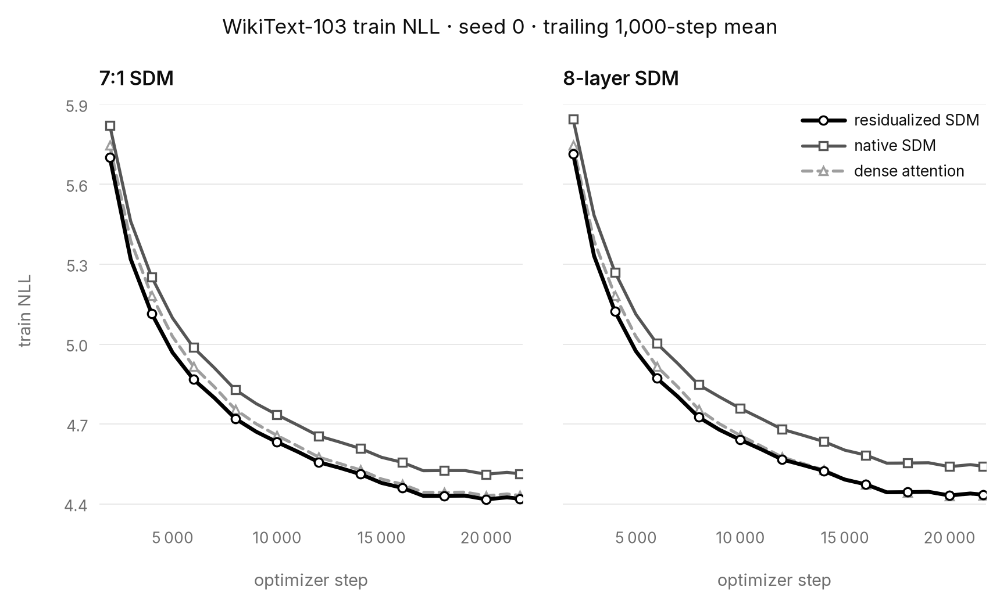
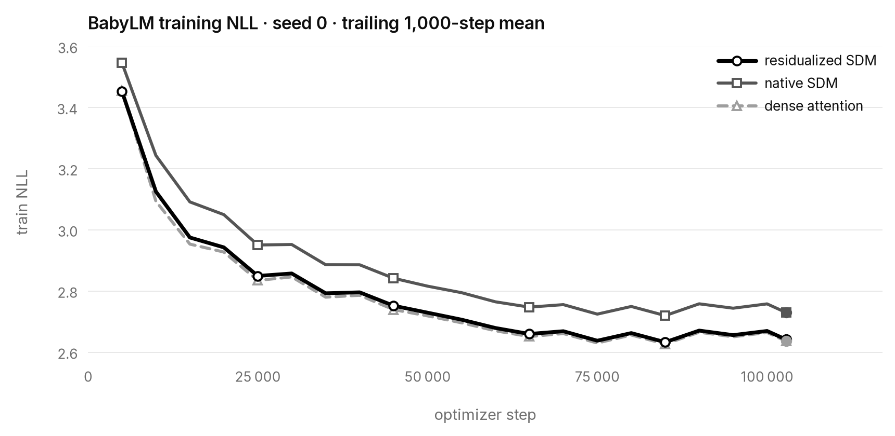
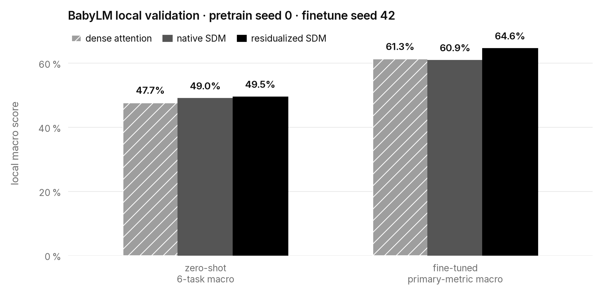

# Residualized Routing for Sparse Delta Memory

## Intuition

Sparse Delta Memory (SDM) stores information in a few selected rows. A later
read must find those rows to use it. Native SDM learns separate read and write
maps, initialized independently at random. Even the same input can initially
send a write to one neighborhood and a read to another.

A common starting map removes that initial mismatch. Keeping a trainable
shared component also lets gradients from either role move both maps together.
Separate read and write residuals let each role adjust its own route. The idea
is to give storage and retrieval a common reference while letting them
specialize.

## Construction

**Router residualization** replaces two independent affine maps with a shared
base plus two residuals. The base weights start at the average of the randomly
initialized native read and write weights; all biases and residuals start at
zero.

During training, route hidden representation `h` through:

```text
base(h)  = W_base h + b_base
read(h)  = base(h) + ΔW_read h  + Δb_read
write(h) = base(h) + ΔW_write h + Δb_write
```

The base and both residuals are trainable. The experiments test the common
initialization and this parameterization together.

Both SDM variants use the same adapted sparse runtime; “native” names its
independent read/write router. Product-key selection and initial memory,
balanced R=W access, normalization, and the gated-delta update are unchanged.

## Result

Five matched seed-0 models compare dense attention with native and residualized
SDM on WikiText-103 (~15M parameters) and Adaptive Recall (~2M). The SDM stacks
use either seven SDM layers plus final attention (7:1) or SDM in all eight
layers. Recall requires all 16 answers in an example to be correct.

| Model | WikiText-103 test NLL | Adaptive Recall exact-set accuracy |
|---|---:|---:|
| Dense attention | 4.36248 | 56.25% |
| 7:1 native SDM | 4.45031 | 56.28% |
| 8-layer native SDM | 4.48206 | 44.86% |
| 7:1 residualized SDM | 4.36357 | 55.46% |
| 8-layer residualized SDM | 4.37999 | 55.38% |

On WikiText-103, residualization closes **98.8%** of the 7:1 native model's
test-NLL gap to dense attention and **85.4%** of the all-SDM gap. The training
curves show the residualized models tracking close to dense attention.



Residualization also recovers **92.4%** of the all-SDM exact-retrieval gap.
With final attention, native SDM already matches dense attention on recall,
and residualization gives no further retrieval gain.

### Scaling the comparison to BabyLM

At 80–85M parameters and 1.69B token presentations, residualization
closes **94.6%** of native SDM's training-NLL gap to dense attention.



Residualized SDM improves all seven fine-tuning tasks over native SDM. Its
mean primary task metric reaches **64.60%**, versus
60.92% for native SDM and 61.31% for dense attention.

Zero-shot gains are mixed: four of six tasks improve over native SDM, while
EWoK and Global PIQA decline.



Local validation results:

| Evaluation | Task | Metric | Dense attention | Native SDM | Residualized SDM |
|---|---|---|---:|---:|---:|
| Zero-shot | BLiMP | Accuracy | 66.60% | 71.81% | **74.43%** |
| Zero-shot | BLiMP Supplement | Accuracy | 59.40% | 60.18% | **63.86%** |
| Zero-shot | COMPS | Accuracy | 51.90% | 53.49% | **54.13%** |
| Zero-shot | Entity Tracking | Accuracy | 18.01% | 20.22% | **20.49%** |
| Zero-shot | EWoK | Accuracy | **51.41%** | 51.24% | 51.00% |
| Zero-shot | Global PIQA | Accuracy | **38.65%** | 37.17% | 33.18% |
| Fine-tuned | BoolQ | Accuracy | 64.59% | 64.53% | **66.36%** |
| Fine-tuned | MNLI | Accuracy | 47.37% | 44.91% | **51.83%** |
| Fine-tuned | MRPC | F1 | 80.37% | 79.51% | **82.80%** |
| Fine-tuned | MultiRC | Accuracy | **58.29%** | 57.34% | 58.21% |
| Fine-tuned | QQP | F1 | 58.99% | 60.32% | **64.79%** |
| Fine-tuned | RTE | Accuracy | **61.87%** | 58.27% | 58.99% |
| Fine-tuned | WSC | Accuracy | 57.69% | 61.54% | **69.23%** |

Global PIQA averages its two English splits. Fine-tuning reports the best
validation score for each task.

## Why it matters

A final attention layer can recover much of an SDM stack's retrieval quality.
In these seed-0 runs, changing the router closes most of the gap to dense
attention on both language loss and exact retrieval with SDM in every layer.
The sparse memory and its update rule stay the same.

A shared base plus role residuals is therefore a useful way to improve the
tested recurrent stack without adding attention.

## Reproduction

Run the five WikiText-103 models from a clean checkout:

```bash
uv sync --frozen
uv run --no-sync ./reproduce.sh all
```

See [REPRODUCING.md](REPRODUCING.md) for hardware, runtime, data preparation,
and the Recall and BabyLM commands. Exact settings and metric definitions are
in [APPENDIX.md](APPENDIX.md), with measurements and provenance in
[data/](data/) and [provenance.json](provenance.json).

Original code is MIT-licensed; vendored SDM and Meta Lingua-derived files retain
their upstream licenses. See [THIRD_PARTY.md](THIRD_PARTY.md).

## References

- Loïc Cabannes et al., [Sparse Delta Memory: Scaling the State of Linear RNNs through Sparsity](https://arxiv.org/abs/2607.07386), 2026.
- Kaiming He et al., [Deep Residual Learning for Image Recognition](https://arxiv.org/abs/1512.03385), 2015.
- Leshem Choshen et al., [BabyLM Turns 4 and Goes Multilingual: Call for Papers for the 2026 BabyLM Workshop](https://arxiv.org/abs/2602.20092), 2026.
